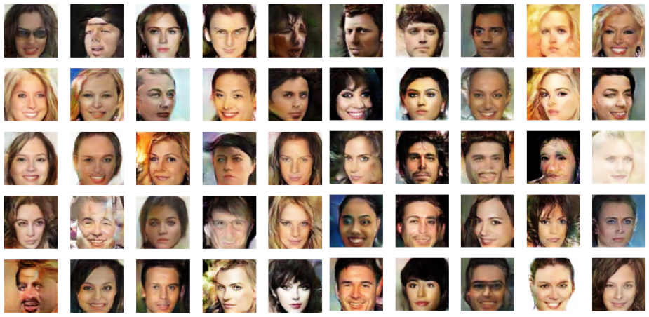
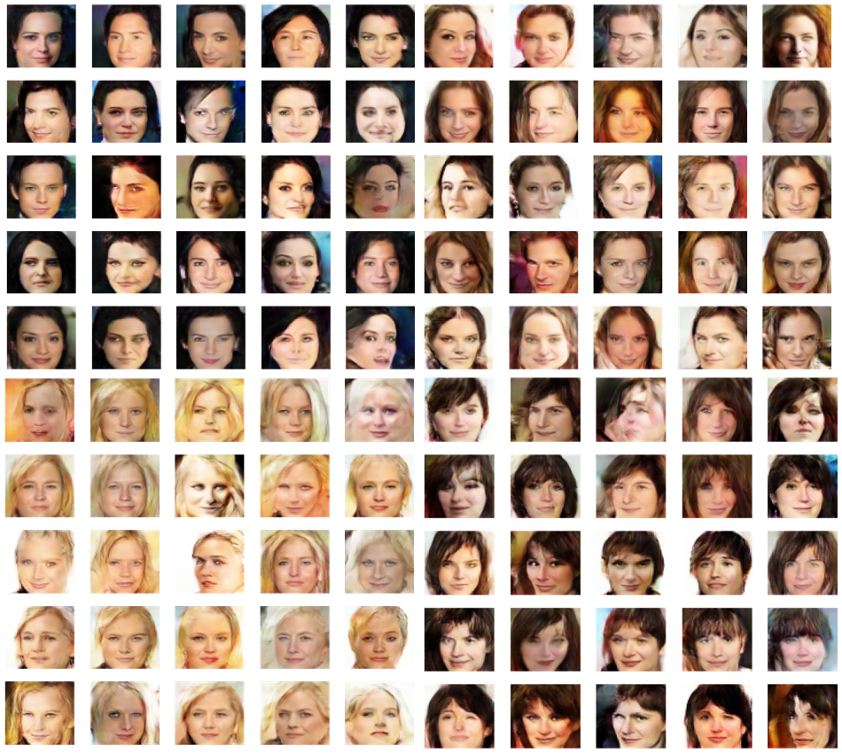
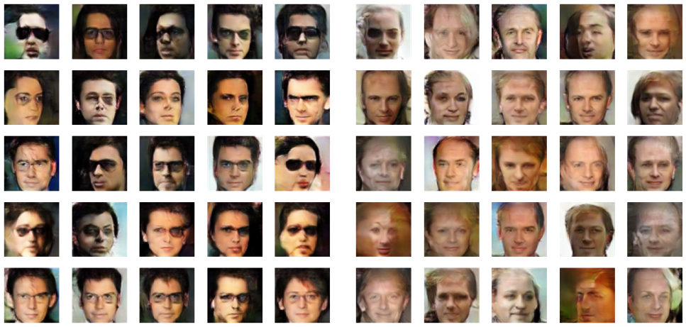

# CelebA-Conditional-GAN

If you do not want to download the datatest zip file and the attribute file from http://mmlab.ie.cuhk.edu.hk/projects/CelebA.html you can use the VAC+GAN+tfrec notebook. Doing so the dataset is loaded from a Google Cloud bucket. Please notice that it will be available on it till April 2021. If you prefer to load the datatest from tfrecords after that date you can use the celeba_tfrec script to create your tfrec files and upload them on a Google Cloud bucket that you prefer, then you have just to modify a little bit the notebook code by changing the path of the bucket.

## Network

  

In this kind of approach, the Generative Adversarial Network generator is turned into a conditional generator by placing a multi-class classifier in parallel with the discriminator network and backpropagate the classification error through the generator. This technique is versatile enough to be applied to any GAN.

## Results

Images generated from random labels of the dataset

Top-Left: Young = 1, Attractive = 1, Black_Hair  = 1, Smiling = 1, Heavy_Makeup = 1, No_Bread = 1  

Top-Right: Young = 1, Attractive = 1, Brown_Hair  = 1, Smiling = 1, Heavy_Makeup = 1, No_Bread = 1

Bottom-Left: Young = 1, Attractive = 1, Blond_Hair  = 1, Smiling = 1, Heavy_Makeup = 1, No_Bread = 1 

Bottom-Right: Young = 1, Attractive = 1, Brown_Hair  = 1, Smiling = 1, Heavy_Makeup = 1, No_Bread = 1, Bans = 1

Left: Male = 1, Young = 1, Attractive = 1, Black_Hair  = 1, Eyeglasses = 1, No_Bread = 1 

Right: Male = 1, Attractive = 1, Bald = 1, Big_Nose = 1, No_Bread = 1

## Authors

**Simone Gayed Said** - simone.gayed@studio.unibo.it  
**Pierpasquale Colagrande** - pierpasquale.colagrande@studio.unibo.it  

## References
- Ilya Kavalerov, Wojciech Czaja, Rama Chellappa. cGANs with Multi-Hinge Loss. 	arXiv:1912.04216 [cs.LG],], Dec. 2019

- Yan Wu, Jeff Donahue, David Balduzzi, Karen Simonyan, Timothy Lillicrap. LOGAN: Latent Optimisation for Generative Adversarial Networks. arXiv:1912.00953 [cs.LG], Dec 2019

- Yang Zhao, Chunyuan Li, Ping Yu, Jianfeng Gao, Changyou Chen. Feature Quantization Improves GAN Training. arXiv:2004.02088 [cs.LG], Apr 2020

- Sophie Searcy, https://soph.info/odsc2019, May 2019

- Shabab Bazrafkan, Peter Corcoran. Versatile Auxiliary Classifier with Generative Adversarial Network (VAC+GAN), Multi Class Scenarios. arXiv:1806.07751 [cs.LG], Jun 2018

- Martin Heusel, Hubert Ramsauer, Thomas Unterthiner, Bernhard Nessler, Sepp Hochreiter. GANs Trained by a Two Time-Scale Update Rule Converge to a Local Nash Equilibrium.  arXiv:1706.08500 [cs.LG], Jun 2017

- Takeru Miyato, Toshiki Kataoka, Masanori Koyama, Yuichi Yoshida. Spectral Normalization for Generative Adversarial Networks.  arXiv:1802.05957 [cs.LG], Feb 2018

- Martin Heusel, Hubert Ramsauer, Thomas Unterthiner, Bernhard Nessler, Sepp Hochreiter. GANs Trained by a Two Time-Scale Update Rule Converge to a Local Nash Equilibrium.  arXiv:1706.08500 [cs.LG], Jun 2017

- Yaniv Benny, Tomer Galanti, Sagie Benaim, Lior Wolf. Evaluation Metrics for	Conditional Image Generation. arXiv:2004.12361, Apr 2020

